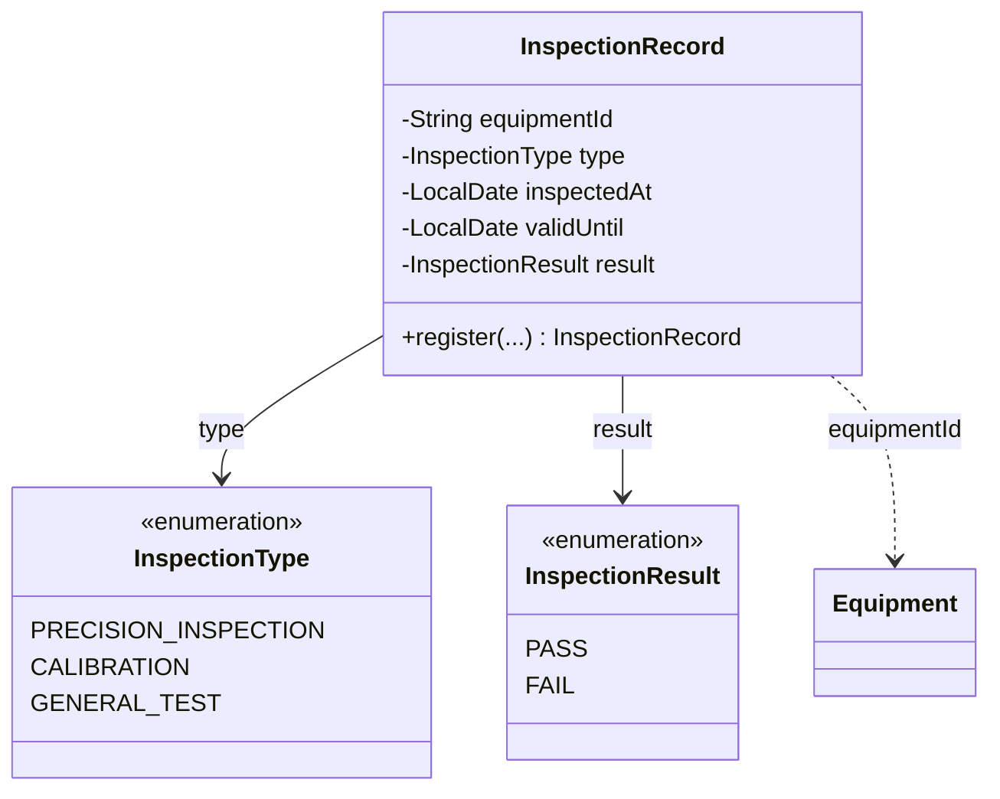

```mermaid
classDiagram
    InspectionRecord --> InspectionType : type
    InspectionRecord --> InspectionResult : result
    InspectionRecord ..> Equipment : equipmentId

    class InspectionRecord {
        -String equipmentId
        -InspectionType type
        -LocalDate inspectedAt
        -LocalDate validUntil
        -InspectionResult result
        
        +register(...) InspectionRecord
    }

    class InspectionType {
        <<enumeration>>
        PRECISION_INSPECTION
        CALIBRATION
        GENERAL_TEST
    }

    class InspectionResult {
        <<enumeration>>
        PASS
        FAIL
    }
```